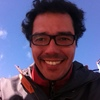

# Expositores

## Andrés Ortega

**Arquitecto PUCV**. Coordinador programa AULAB, diplomado en Arquitectura Sustentable de la Pontificia Universidad Católica de Chile y Branding de Sistemas Territoriales en el Politécnico de Milán, Italia. Ha trabajado en diseño de servicios, desarrollo territorial, diseño estratégico y patrimonio. Actualmente dirige Estudio Racimo, práctica de diseño orientada al diseño de servicios y diseño estratégico y, colabora en distintos proyectos como investigador. |

## Dámaris Sepúlveda

**Diseñadora Gráfica PUCV**. Se especializó en diseño de servicios centrándose en la experiencia de los pacientes en servicios de salud tanto públicos como privados. Emprendió con una startup orientada a ayudar a pacientes diabéticos y actualmente es diseñadora de servicios dentro del área de proyectos del Laboratorio de Gobierno donde trabaja con un equipo multidisciplinario para acercar el diseño de los servicios públicos a las necesidades de las personas. |

## Rodrigo Morales

 

**Arquitecto UV**. Su experiencia laboral se centra principalmente en el desarrollo y ejecución de proyectos urbanos públicos así como planificación urbana. Actualmente trabaja en el departamento de Desarrollo Urbano del MINVU en los sectores de las comunas de Concón y Quilpué. Es presidente de la contraparte del Estudio del Plan regulador de Limache.

