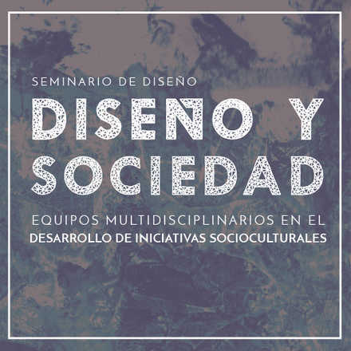

# Diseño y Sociedad

|| <!-- empty table header -->
|:--:| <!-- table header/body separator with center formatting -->
| I'm centered! | <!-- cell gets column's alignment -->

**Transcripciones de los audios del seminario realizado el 27 de Noviembre de 2015 en la e[ad] Escuela de Arquitectura y Diseño, Pontificia Universidad Católica de Valparaíso.**

Este seminario se encofó en cómo trabaja y opera el diseñador dentro de equipos multidisciplinarios enfocando su trabajo en temáticas sociales, ampliando la noción metodológica del diseño en su inclusión social.